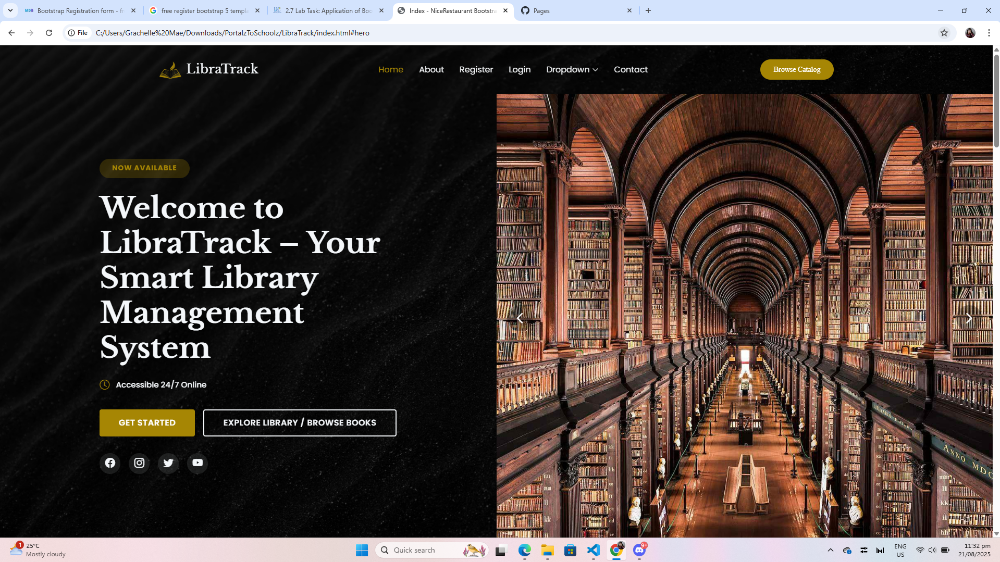
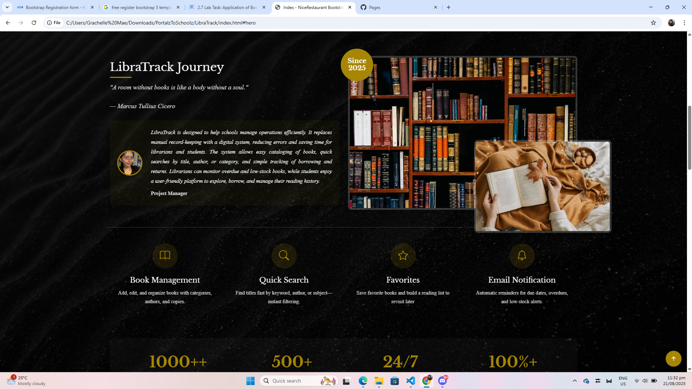
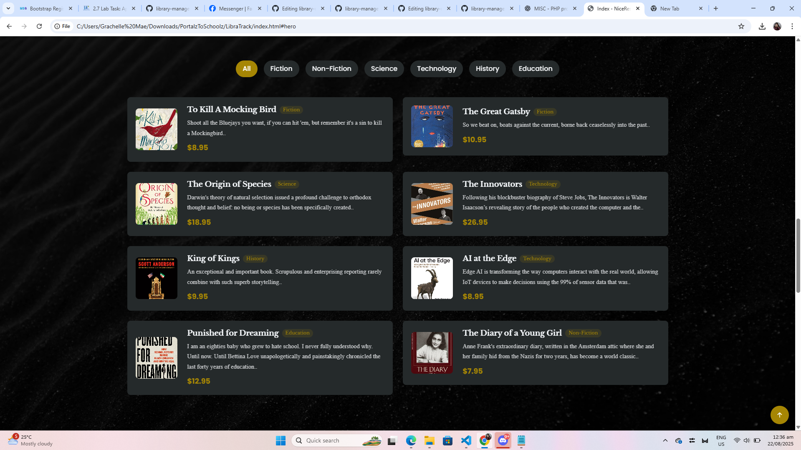
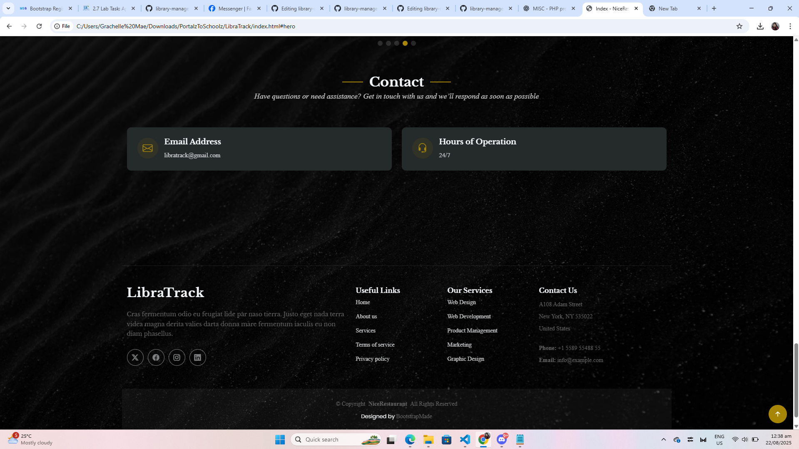
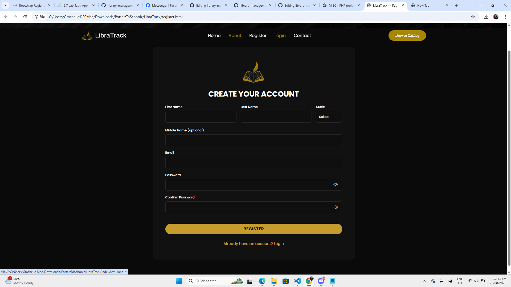
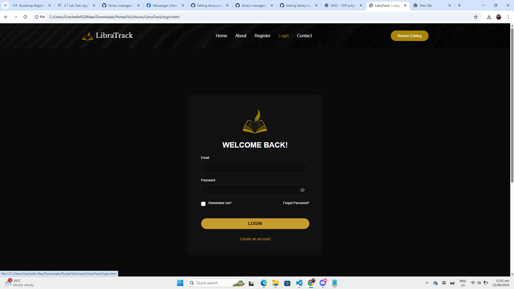
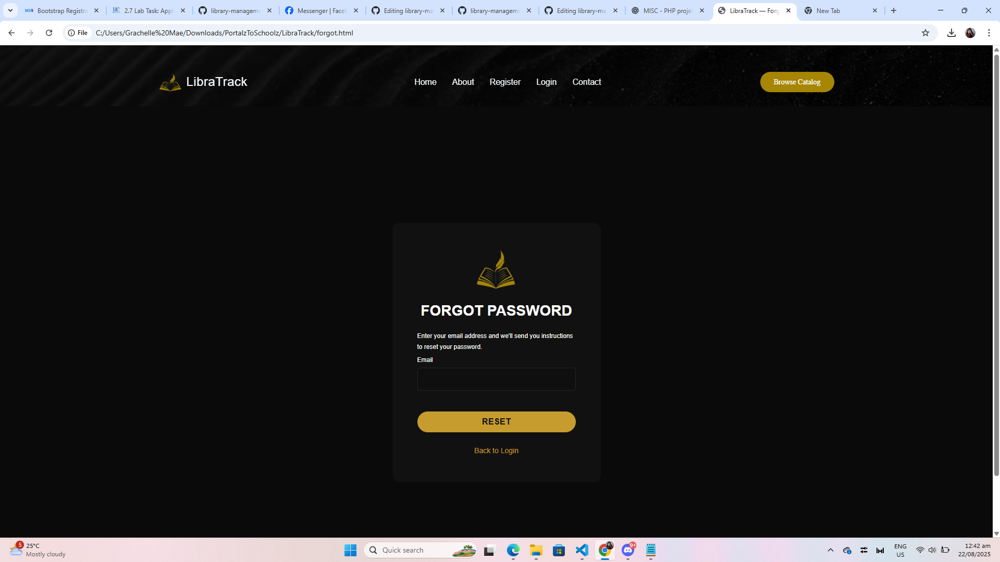

# Project Title: LibraTrack: Library Management System  

Responsive Bootstrap 5 layouts for Homepage, Registration, Login, and Forgot Password  

LibraTrack is a PHP-based platform designed to help schools manage library operations efficiently. It replaces manual record-keeping with a digital system, reducing errors and saving time for librarians and students. The system lets librarians add, edit, and organize books; register student members; and track borrowing and returns while monitoring low-stock and overdue items. It includes quick book searches by title, author, or category, plus simple email alerts for overdue or low-stock books. This system is intended for librarians and students who need a secure, organized, and easy-to-use library tool.  

---

## Group Members
- Grachelle Mae A. Carmelotes  
- Edmar Angelo S. Generoso  

---

## Screenshots

| Page              | Screenshot |
|-------------------|------------|
| **Home**          |  |
| **Home (Alt)**    |  |
| **Home (Alt 3)**  |  |
| **Books Page**    |  |
| **Another Page**  |  |
| **Register**      |  |
| **Login**         |  |
| **Forgot Password** |  |

## Live Demo URL
https://ashanniah09.github.io/library-management-system/
